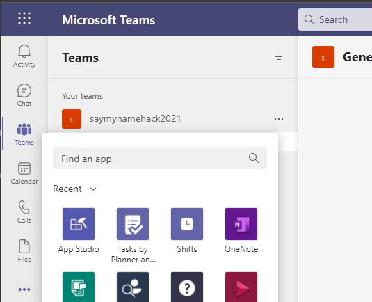

# Channel and group tabs in ASP.NET Core 3.0

We'll walk-through creating a custom channel/group tab with C# and ASP.Net Core 3.0. We'll also use App Studio for Microsoft Teams to finalize your app manifest and deploy your tab to Teams.

## Running the sample

For complete instructions on running this sample see:

[Create a Custom Channel and Group Tab with ASP.NET Core](https://docs.microsoft.com/microsoftteams/platform/tabs/quickstarts/create-channel-group-tab-dotnet-core)

# Tabs

Tabs are Teams-aware webpages embedded in Microsoft Teams. Tabs allow team members to access services and content in a dedicated space within a channel or in a chat. This lets the team work directly with tools and data, and have conversations about the tools and data, all within the context of the channel or chat.
Owners and team members can add tabs to a channel, private chat, and group chat to help integrate their cloud services. Tabs can be added to help users easily access and manage the data they need or interact with the most. 

## Prerequisites

-  [ngrok](https://ngrok.com/)

-  [M365 developer account](https://docs.microsoft.com/en-us/microsoftteams/platform/concepts/build-and-test/prepare-your-o365-tenant) or access to a Teams account with the appropriate permissions to install an app.

## ngrok

Teams needs to access your tab from a publically accessible URL. If you are running your app in localhost, you will need to use a tunneling service like ngrok. Run ngrok and point it to localhost.

Note: It may be worth purchasing a basic subscription to ngrok so you can get a fixed subdomain ( see the --subdomain ngrok parameter)

## Upload your tab to Teams with App Studio
- Open the Microsoft Teams client. If you use the web based version you can inspect your front-end code using your browser's developer tools.
- Open App studio and select the Manifest editor tab.

- Select the Import an existing app tile in the Manifest editor to begin updating the app package for your tab. The source code comes with its own partially complete manifest. The name of your app package is appPackage.zip. It should be found here:[appPackage](./appPackage)
- Upload appPackage.zip to App Studio.
- Select the tile for your newly imported tab in the right panel of the Manifest editor welcome page.
- In the App details section:
    - Under Identification select Generate to generate a new App Id for your app.
    - Under Developer information update the Website URL with __YOUR HTTPS URL__.
    - Under App URLs update the Privacy statement to __YOUR HTTPS URL__/Privacy and Terms of use to __YOUR HTTPS URL__/TermsOfUse.
- In the Tabs section:
    - Team Tab: select Add.
    - In the Team tab pop-up window, update the Configuration URL to __YOUR HTTPS URL__/tab
    - Finally, make sure the can update configuration? Team, and Group chat boxes are checked and select Save.
- Finish: Domains and permissions
    - In the Domains and permissions section, the Domains from your tabs field should contain __YOUR HTTPS URL__ without the HTTPS prefix.
- Finish: Test and distribute (Group Tab)
    - Select Install.
    - In the pop-up window make sure that Add for you is set to Yes and Add to a team or chat is set to No.
    - In the next pop-up window choose the team channel or chat where you would like the tab displayed and select Set up.
    - In the final pop-up window,  select Save.
- View your tab
    - To view your tab, navigate to the team you installed it on, and select it from the tab bar. The page that you chose during configuration should be displayed.

